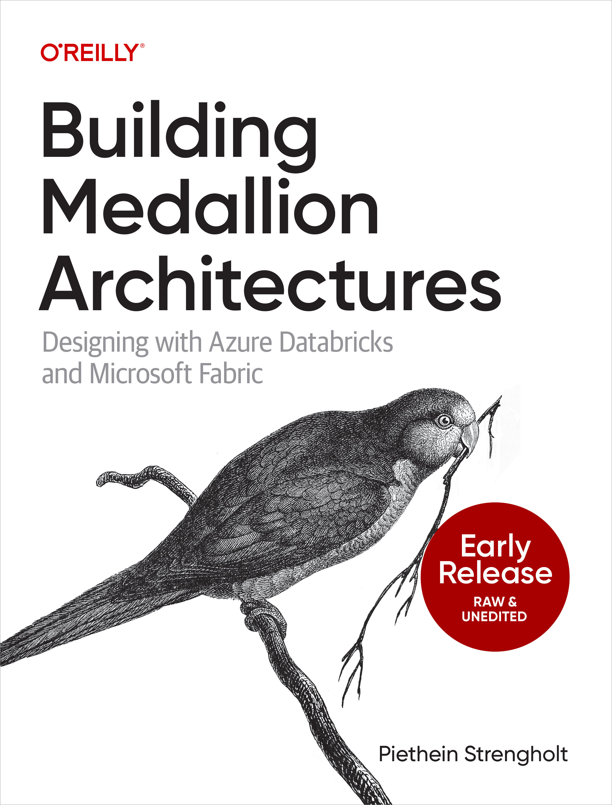

# Building Medallion Architectures

This GitHub repository contains all the Python and SQL notebooks and scripts used in the book "Building Medallion Architectures." Here, you can find the code samples and examples that accompany each chapter of the book, allowing you to follow along and experiment with the concepts discussed. The repository is organized by layers, making it easy to locate the relevant scripts and notebooks for each topic. Feel free to clone, fork, and contribute to this repository as you explore the world of Medallion Architectures!